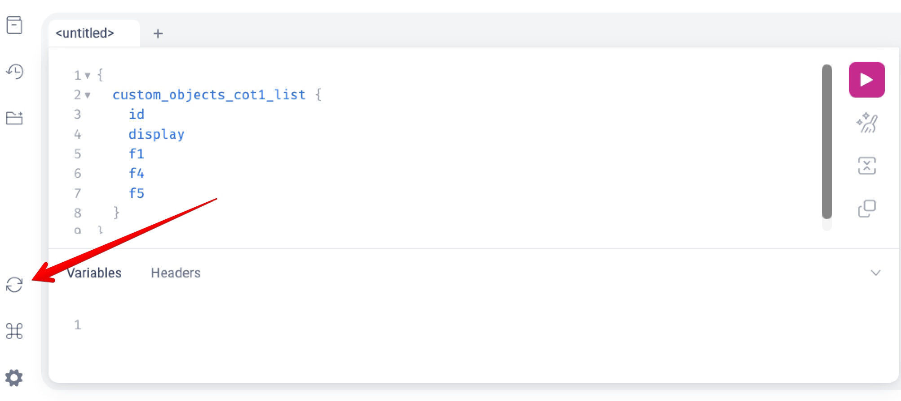

# GraphQL API

The NetBox Custom Objects plugin exposes custom objects through NetBox's GraphQL
API at the standard `/graphql/` endpoint, alongside NetBox's built-in models. For
each Custom Object Type you have defined, two root query fields are generated:

- `<name>` — fetch a single custom object by `id`.
- `<name>_list` — fetch a list of custom objects (paginated).

The `<name>` is `custom_objects_<slug>`, where `<slug>` is the Custom Object
Type's **slug** with any characters that are not valid in a GraphQL name replaced
by underscores (for example a type with slug `dhcp-scope` becomes
`custom_objects_dhcp_scope` and `custom_objects_dhcp_scope_list`).

The `custom_objects_` prefix namespaces these fields so they can never collide
with NetBox's own (or another plugin's) root query fields — every plugin's
GraphQL query is merged into NetBox's single global `Query`, so a bare,
slug-derived name like `site` or `group` would otherwise be shadowed by a core
model's field.

## Authentication

GraphQL requests use the same authentication as the REST API. Pass a token in the
`Authorization` header:

```
Authorization: Token <your-api-token>
```

Object-level permissions are enforced. The top-level `<name>` / `<name>_list`
queries only return custom objects the authenticated user has permission to view,
and objects reached through a relationship field are likewise filtered to those
the user may view.

## Using the GraphiQL explorer

NetBox's built-in GraphiQL explorer (at `/graphql/`) loads the GraphQL schema
**once when the page opens** and caches it for the life of the page. Because
custom object types and their fields can change at runtime, the explorer's
autocomplete suggestions and **Documentation** panel can go stale.

If you **add, remove, or change a custom object type's fields**, or **add a new
custom object type**, while GraphiQL is open, those changes will not appear in the
field autocomplete or the Docs panel until GraphiQL re-reads the schema. (The
change is already live on the server — a query using the new field works
immediately — it is only GraphiQL's cached copy of the schema that lags.)

To refresh it, click the **Re-fetch GraphQL schema** button — the circular-arrow
icon in the GraphiQL toolbar (lower left). This re-reads the schema *without*
reloading the page, so your current query is preserved:



Reloading the whole browser page has the same effect, but discards whatever you
have typed in the editor.

!!! note
    This only affects the interactive explorer. Programmatic API clients fetch the
    schema via introspection whenever they choose, and always query against the
    current server-side schema.

## Querying a list

The fields you can select depend on how the Custom Object Type is defined. Every
type exposes `id` and `display`; the examples below also assume the type defines
custom fields named `name` and `description`.

```graphql
query {
  custom_objects_dhcp_scope_list {
    id
    display
    name
    description
  }
}
```

> **Tip:** `display` is the only human-readable field guaranteed to exist on every
> type — it is the value of the type's primary field. `name` exists only if the
> type defines a custom field literally named `name`.

## Querying a single object

```graphql
query {
  custom_objects_dhcp_scope(id: 42) {
    id
    display
  }
}
```

## Available fields

Each generated type exposes:

| Field | Description |
|-------|-------------|
| `id` | The object's primary key. |
| `display` | The object's display string (its primary field value). |
| `created` / `last_updated` | Change-logging timestamps. |
| `tags` | The object's tags. |
| One field per custom field | Named exactly as the field's `name`. |

### Scalar field types

Scalar custom fields map to their natural GraphQL types:

| Custom field type | GraphQL type |
|-------------------|--------------|
| text, long text, URL, select | `String` |
| integer | `Int` |
| decimal | `Decimal` |
| boolean | `Boolean` |
| date | `Date` |
| datetime | `DateTime` |
| JSON | `JSON` |
| multi-select | `[String]` |

### Relationship field types

Object and multi-object fields resolve to the **native GraphQL type** of their
target, so a related object is fully traversable exactly as it would be when
queried directly. A field pointing at a Site resolves to NetBox's `SiteType`:

```graphql
query {
  custom_objects_server_list {
    name
    primary_site {          # an object (single) field → SiteType
      id
      name
      region { name }       # traverse into the related object's own fields
    }
    interfaces {            # a multi-object (list) field → [InterfaceType]
      id
      name
    }
  }
}
```

#### Polymorphic fields

A polymorphic relationship field may point at several different model types. It
resolves to a GraphQL **union** of those types; select fields per type with inline
fragments:

```graphql
query {
  custom_objects_binding_list {
    name
    target {                # polymorphic object field
      ... on SiteType { id name }
      ... on DeviceType { id name }
    }
  }
}
```

#### Fallback for targets without a GraphQL type

A small number of NetBox models are not exposed in GraphQL. When a relationship
field's target has no native GraphQL type, that field falls back to a uniform
`CustomObjectRelatedObjectType` so it is never silently dropped:

| Field | Description |
|-------|-------------|
| `id` | The referenced object's primary key. |
| `object_type` | The referenced object's type, as `<app_label>.<model>`. |
| `display` | The referenced object's display string. |
| `url` | The referenced object's absolute URL, if resolvable. |
